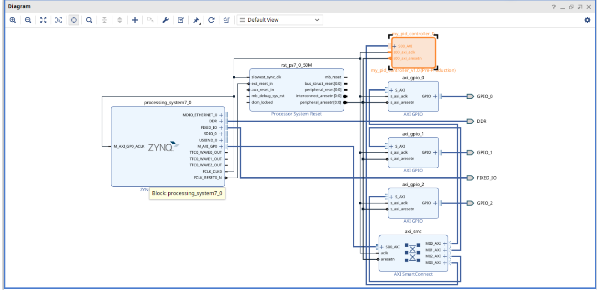
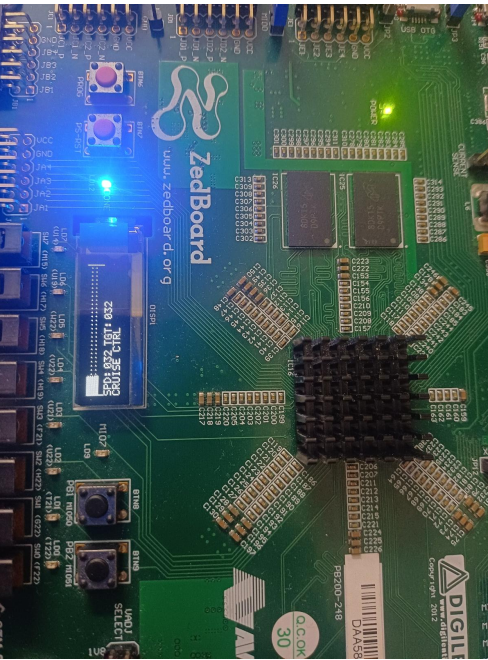

# Hardware-Accelerated Closed-Loop PID Control System

A hardware/software co-design project implementing a **Closed-Loop PID Controller** on the **ZedBoard (Xilinx Zynq-7000 XC7Z020)**. The PID computation is accelerated using a custom **AXI4-Lite Hardware IP**, while the control software is developed using **Xilinx Vitis**.

---

## Project Overview

This project demonstrates a hardware-accelerated Proportional–Integral–Derivative (PID) controller implemented on the ZedBoard FPGA platform. The PID algorithm is executed in custom FPGA hardware through an AXI4-Lite interface, while the embedded software configures the controller parameters and communicates with the hardware accelerator.

---

## Features

- Hardware-accelerated PID computation
- Custom AXI4-Lite IP Core
- Real-time closed-loop control
- Embedded software developed in Vitis
- Modular Verilog RTL implementation
- ZedBoard FPGA implementation
- Memory-mapped register interface
- OLED display support

---

## Hardware

- ZedBoard (Xilinx Zynq-7000 XC7Z020)
- Vivado 2025.1
- Vitis 2025.1

---

## Repository Structure

```text
Hardware-Accelerated-Closed-Loop-PID-Control-System/
│
├── README.md
├── LICENSE
├── .gitignore
│
├── docs/
│   ├── Project_Report.pdf
│   └── README.md
│
├── hardware/
│   ├── rtl/
│   │   ├── my_pid_controller.v
│   │   └── my_pid_controller_slave_lite_v1_0_S00_AXI.v
│   │
│   ├── constraints/
│   │   └── zedboard.xdc
│   │
│   └── block_design/
│       ├── blockdesign.png
│       └── README.md
│
├── vitis/
│   ├── src/
│   │   └── main.c
│   └── README.md
│
└── images/
    └── output.png
```

---

# System Architecture

```
          +-----------------------------+
          |        Vitis Software       |
          |      (Embedded C Code)      |
          +-------------+---------------+
                        |
                  AXI4-Lite Interface
                        |
                        ▼
        +-------------------------------+
        |     Custom PID Hardware IP    |
        | (Verilog RTL Implementation)  |
        +-------------------------------+
                        |
                        ▼
               Control Effort Output
                        |
                        ▼
               OLED Display / GPIO
```

---

## Vivado Block Design



---

## Project Output

The following image shows the hardware running successfully on the ZedBoard.



---

## Hardware Design

The hardware subsystem consists of:

- Custom AXI4-Lite PID Controller IP
- Processor subsystem
- AXI Interconnect
- Clock and Reset Logic
- GPIO Interface
- Memory-mapped PID Registers
- OLED Display Interface

---

## Software

The Vitis application performs the following operations:

- Initializes the hardware platform
- Configures PID parameters
- Writes PID gains through AXI4-Lite
- Reads the computed control effort
- Displays output on the OLED
- Executes the closed-loop control algorithm

---

## Technologies Used

- Verilog HDL
- Embedded C
- AXI4-Lite Protocol
- Xilinx Vivado 2025.1
- Xilinx Vitis 2025.1
- FPGA Hardware Acceleration

---

## Documentation

The complete project report is available in:

```text
docs/Project_Report.pdf
```

---

## Future Improvements

- Floating-point PID implementation
- AXI Stream interface
- DMA support
- Sensor integration
- Performance optimization
- Real-time data logging

---

## Author

**Sathish M**

Electronics and Communication Engineering

PSG College of Technology

GitHub: https://github.com/rio-sathish
